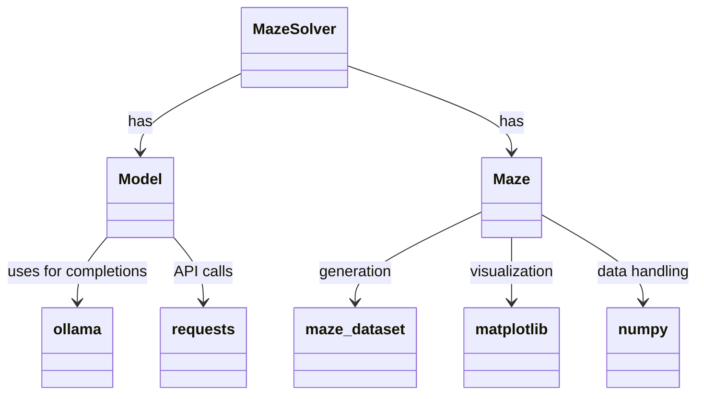

# llm-maze-tester

## Introduction

This project aims to test the ability of various foundational models to navigate and solve a maze.

This project uses Nix for dev env automation. To install the project dependencies and enter development shell run:

```sh
nix develop
```

To see available commands run:

```sh
just
```

## Tech

### Nix

Nix is used for development environment automation

### Just

The project uses just to simplify cli commands

### UV

This project uses uv python package manager

Python dependencies are listed in the `pyproject.toml` file.

### Ollama

This project uses [Ollama](https://ollama.com/) to run the models locally.

### maze-dataset

[maze-dataset](https://github.com/understanding-search/maze-dataset) library is used to generate and print the maze

### Design

Class Diagram


