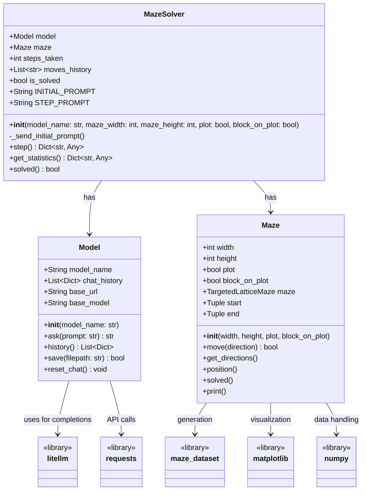

# llm-maze-tester

## Introduction

This project aims to test the ability of various foundational models to navigate and solve a maze

To run the project:

`uv run main.py`

## Tech

### UV

This project uses uv python package manager

Python dependencies are listed in the `pyproject.toml` file.

### Ollama

This project uses [Ollama](https://ollama.com/) to run the models locally.

### maze-dataset

[maze-dataset](https://github.com/understanding-search/maze-dataset) library is used to generate and print the maze

### Design

Class Diagram

